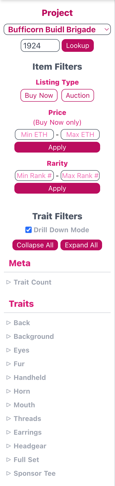
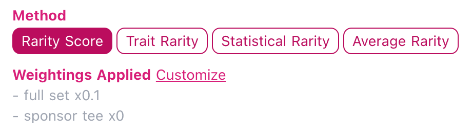

# Analytic Tool for Hedera NFTs
NFT analytics tools are useful to NFT collectors and investors because they enable:

- Analysis of sales statics of individual NFTs, collections, artists, and marketplaces
- Assignment of a relative rarity score to generative collections

Building an NFT analytics tool consists of tasks in 2 main areas:

- Collecting NFT metadata and sales data, then efficiently storing it in a our backend database
- Providing an interface for end users to query and display the data

## Hedera NFT Marketplaces
- HashAxis (https://hashaxis.com/)
- ZuseMarket (https://zuse.market/)
- TurtleMoon (https://www.turtlemoon.io/) -- Listed on Hedera's website, but doesn't appear to be functional.

## Data Aquisition
Current state can be aquired using the [Hedera Javasxcript SDK](https://github.com/hashgraph/hedera-sdk-js).

Historical data is available from [GraphQL for Hedera](https://hgraph.io). This is a publically available API. It isn't
specified whether there is a SLA or the queries are throttled.

Results from these queries will need to be summarized and cached in our backend system. We will also need to calculate a rarity number for each item in the collection so that the relative rarities can be ranked. We should deploy an IPFS server to cache (aka pin) images for serving to the end user.

### Example Query
These examples use the [Loco Lizards](https://zuse.market/collection/0.0.1158353) collection.

```graphql
# $token_id is the number after the second period in a Hedera address
query GetNftCollection($token_id: bigint = "1158353") {
    nft(where: {token_id: {_eq: $token_id}}) {
        account_id
        deleted
        metadata
        serial_number
    }
}
```

#### Results

```json
{
  "data": {
    "nft": [
      {
        "account_id": 1147060,
        "deleted": false,
        "metadata": "\\x697066733a2f2f516d5a53553237766a727461456b5336686b414b6378325346444131326b447a386e6f77733257737754574b4151",
        "serial_number": 1
      },
      …
    }
    }
```

The value of `metadata` is a hex encoded ASCII string. In the example, its ASCII value
is `ipfs://QmZSU27vjrtaEkS6hkAKcx2SFDA12kDz8nows2WswTWKAQ`, which is the IPFS address of the metadata file for the NFT.
It contains:

```json
{
  "name": "Loco Lizard",
  "description": "Loco Lizardz are a tribe of 2222 party loving, music vibing, Web3 exploring beings minted on the Hedera Network. Learn more at LocoLizardz.com",
  "creator": "Loco Lizards",
  "category": "Collectible",
  "image": "ipfs://QmRW1q6zX9bDQzcoqK17QzhUC1fcK5U6ew3mPz7b571y6z",
  "type": "image/png",
  "attributes": [
    {
      "trait_type": "Background",
      "value": "Orange Background"
    },
    {
      "trait_type": "Skin",
      "value": "Dark Green Skin"
    },
    {
      "trait_type": "Eyes",
      "value": "Red Eyes"
    },
    {
      "trait_type": "Headwear",
      "value": "Green Card Hat"
    },
    {
      "trait_type": "Eyewear",
      "value": "Yellow Loco Eyes"
    },
    {
      "trait_type": "Neck Chain",
      "value": "No Chain"
    },
    {
      "trait_type": "Outfit",
      "value": "White Smiley Face T-Shirt"
    },
    {
      "trait_type": "In the Hand",
      "value": "Aqua Cocktail"
    },
    {
      "trait_type": "VIP Band",
      "value": "Blue VIP Band"
    },
    {
      "trait_type": "DJ Decks",
      "value": "No DJ Decks"
    },
    {
      "trait_type": "Headphones",
      "value": "Purple Headphones"
    },
    {
      "trait_type": "In the Mouth",
      "value": "No Mouth Item"
    },
    {
      "trait_type": "Lasers",
      "value": "No Lasers"
    }
  ]
}
```


### Sales Data Query
Example Query:
```graphql
query GetNftTransactions($token_id: bigint = "1158353", $serial_number: bigint = "1") {
    nft(where: {
        token_id: {_eq: $token_id},
        serial_number: {_eq: $serial_number}
    }) {
        account_id
        transactions {
            payer_account_id
            receiver_account_id
            sender_account_id
            crypto_transfer {
                amount
                entity_id
                consensus_timestamp
                is_approval
                payer_account_id
            }
            crypto_transfer_aggregate {
                nodes {
                    amount
                    payer_account_id
                    entity_id
                }
            }
        }
        serial_number
    }
}
```
*Note: This query fails due to a limit on hgraph.io*

## Queries and Presentation
For reference, here is a screen shot of the query widget from [Rarity Tools](https://rarity.tools/bufficornbuidlbrigade):



Translating user input on this form into the appropriate DB query and displaying the result should be fairly straightforward.

### Rarity Calculation
Rarity Tools has a few different ways of calculating the rarity number. The options that are listed in the rarity.tools UI are:



They wrote up a Medium article that describes the [rarity calculation methods](https://raritytools.medium.com/ranking-rarity-understanding-rarity-calculation-methods-86ceaeb9b98c). Based on that article, rarity score is the probably the preferred method.

In addition to the statistical calculation of the trait scores, we may also want to include a calculation that considers the standard deviation of the trait count. We may also want to adjust for and statistical correlation between traits. For example, if 'Queen' tokens and only Queen tokens have a 'crown', rarity of 'crowns' and 'queens' is the same, so one of the traits should be ignored in the rarity score.

## Other Token Analytics sites
- [Rarity tools](https://rarity.tools/otherdeed)
- [Etherscan](https://etherscan.io/token/0x5d95c4C73E152727750dF27ff7DA1C7169430dd6#inventory)
- [Rarity sniper](https://raritysniper.com/bored-ape-yacht-club)
- [Traitsniper](https://app.traitsniper.com/boredgorillayachtclub?)
- [HowRare](https://howrare.is/abc)
- [Icy.tools](https://icy.tools/collections/y00ts-yacht-club/overview) 

## Analysis of the opportunity
Most of the NFT analytic sites that I found only provide analysis of NFTs on Ethereum and other EVM chains. If we create an analysis tool, it is relatively easy to build data collectors for to multiple chains. By targeting top 25 blockchains by NFT sales volume, we would be providing tools to several blockchains that have healthy NFT ecosystems.

The revenue model for most of these is charging a listing fee to the project for being listed on the site. The downside of this approach is that many of the sites have a fairly incomplete listing of NFTs. If we a adopted a freemium model, it would give us a competitive advantage for onboarding tokens, but it's hard to see how that would be converted into revenue at a later time. Maybe a spamming service for new NFT drops???